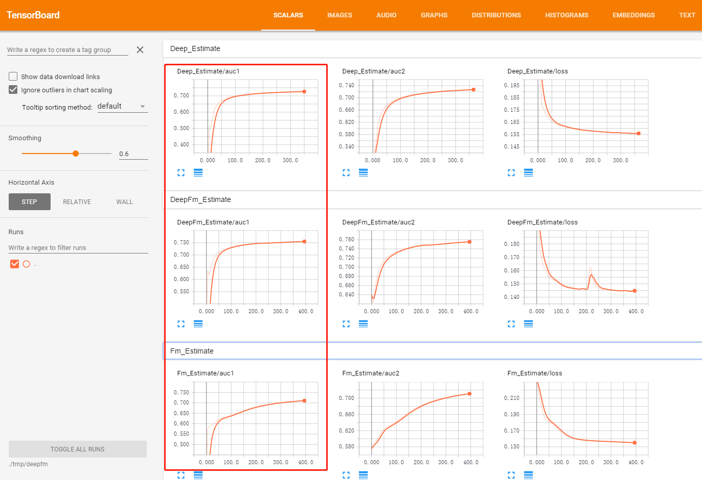
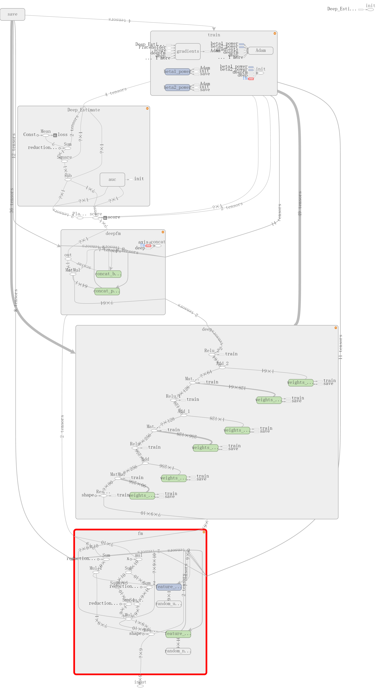

通过tensorflow实现dnn、fm与deepfm三种ctr预测模型，训练出的model file可通过tensorflow serving用于线上推荐打分。
 传统的DNN虽然能够学习到非常复杂的高阶特征，但是对于高度稀疏的特征来说，这种隐式交叉并未带来足够的优异性，有必要引入新的层级结构：1. 设计新的layer，完成显式的特征交叉；2. 借助LR/FM等线性模型，帮助DNN学习更好的特征表示
 运行方式:
 python deepfm_train4tesla.py  --log_dir ./data/test.txt --model_type 0
 通过脚本中参数model_type可控制0 deepfm ,1 only fm ,2 only dnn
 通过tensorboard观察测试数据在3种模型auc和loss等指标
 项目详细介绍见KM分享[DeepFM模型-模型实践篇](http://km.oa.com/articles/view/356062)

 tensorflow graph

 实现方法参考：[A Factorization-Machine based Neural Network for CTR Prediction](https://arxiv.org/abs/1703.04247)